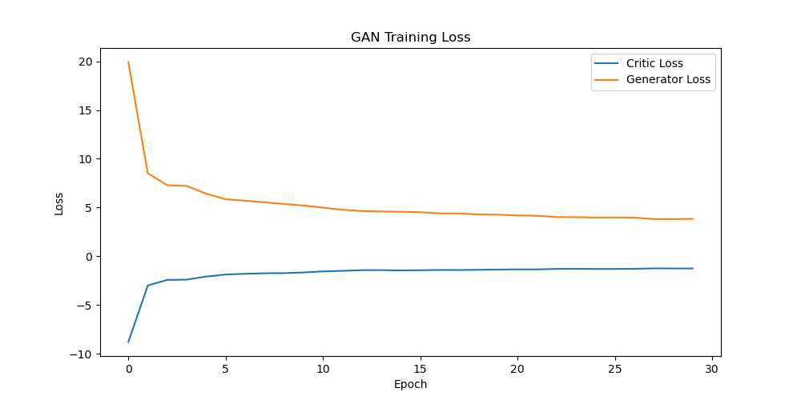

# Let's Play with ProGAN

This repository implements a **Progressive Generative Adversarial Network (ProGAN)** using PyTorch. The model consists of a **Generator** and **Critic** (Discriminator) that progressively grow the image resolution during training.


## Project Overview

This project aims to generate realistic images using a **progressive training strategy**, where both the generator and critic start with low-resolution images and gradually increase the resolution, allowing the network to focus on finer details as it progresses. This technique is useful for generating high-quality images while maintaining training stability.

The architecture is based on **Wasserstein GAN** with **Gradient Penalty** (WGAN-GP) for stable training. The generator creates fake images, and the critic classifies whether an image is real or fake, training both networks to improve over time.


## Project Structure

```
- assets/: Folder to store training loss graphs and GIFs of generated fake images.
- dataset/: Folder to store the dataset you want to use to train your model. You may change the folder name, you will also need to change DATASET_DIR at config.py
- generated_images: Folder to store generated fake images.
- logs/: Folder to store TensorBoard logs and training progress.
- models/: Folder to store model checkpoints.
- config.py: Configuration file to specify settings and hyperparameters.
- model.py: Contains the model definitions for the Generator and Critic.
- train.py: Handles the training loop, including the setup of the model, optimizers, data loaders, and logging.
- utils.py: Utility functions for saving/loading models, calculating gradient penalties, logging metrics, and more.
```


## Installation:

Clone this repository to your local machine:
```
git clone https://github.com/cxycode32/Lets-Play-With-ProGAN.git
cd Lets-Play-With-ProGAN
```

Install the required dependencies:
```
pip install -r requirements.txt
```


## How to Run?

### Setup

1. Download your dataset from Kaggle, then place the downloaded dataset in the project root directory in a folder named `dataset`.
2. (Optional) You may change the folder name, you will also need to change the `DATASET_DIR` at `config.py`.
3. The configuration parameters (e.g., batch size, learning rate, image resolution) are set in `config.py`.

### Let's Start the Training

1. You may change the `SAVE_MODEL` and `LOAD_MODEL` at `config.py` to `True` or `False` depending on your needs.
2. When `SAVE_MODEL` is set to `True`, your model will be saved inside the `models/` folder every 10 epochs.
3. When `LOAD_MODEL` is set to `True`, you may choose to load the model from which epoch.
4. Run the following command:
```
python train.py
```

### Visualization:

### Training Loss Visualization
Helper function to visualize critic and generator losses. The image will be saved inside the `assets` folder.
```
def plot_training_losses(epoch, critic_losses, generator_losses, save_dir=config.ASSETS_DIR, filename="gan_loss"):
```


### Generated Images
Helper function to generate and save images from the generator model. The generated images will be saved inside the `generated_images` folder.
```
def save_generated_images(epoch_folder, generator, alpha, step, epoch, save_dir=config.IMAGE_DIR, fixed_noise=config.FIXED_NOISE):
```

### Generated Images GIF
Helper function to create a GIF from the generated images. The GIF will be saved inside the `assets` folder.
```
def create_gif(epoch_folder, save_dir=config.ASSETS_DIR, image_dir=config.IMAGE_DIR, filename="gan_training"):
```

### Tensorboard
Helper function to log loss values and generated images to TensorBoard. All these are stored inside the `logs` folder.
```
def log_metrics_to_tensorboard(writer, critic_loss, generator_loss, real_images, fake_images, step):
```

Run the following command:
```
tensorboard --logdir logs
```
After you've finished running the script. If you've changed your `LOG_DIR` at `config.py`, remember to replace `logs` in the command to whatever you've changed to.